<div align="center">


<br/>


<br/><br/>

<table>
<tr>
<td align="center" width="25%">
<br/>
<sub>The problem we solve</sub>
</td>
<td align="center" width="25%">
<br/>
<sub>Our response time</sub>
</td>
<td align="center" width="25%">
<br/>
<sub>Anti-spoofing streams</sub>
</td>
<td align="center" width="25%">
<br/>
<sub>Annual market opportunity</sub>
</td>
</tr>
</table>

<br/>

> ### *"When the storm hits — we pay. Before you even step outside."*

<br/>

</div>

---

<div align="center">

## NAVIGATION

[](#01--the-crisis)
[](#02--our-answer)
[](#03--meet-rajesh)
[](#04--the-triggers)
[](#05--our-unique-edge--earnings-forecast-shield)
[](#06--the-money-model)
[](#07--the-intelligence)
[](#08--the-build)
[](#09--the-numbers)
[](#10--see-it-live)

</div>

---

<br/>
---

<br/>

<div align="center">

## THE TEAM -SAP

> *We are not just building a product. We are building financial protection for millions who have none.*

<br/>

<table>
<tr>

<td align="center" width="20%">

### AKELLA LAKSHMI ANANYA 
### (TEAM LEAD) 

</td>

<td align="center" width="20%">

### BOMMIDI SREE PRANATHI

</td>

<td align="center" width="20%">

### SALAKA MAHALAKSHMI PRIYANKA

</td>

<td align="center" width="20%">

### KOLISETTY SREYA SRI 

</td>

<td align="center" width="20%">

### CHALAMASETTY VENKATA HIMA SRI  

</td>

</tr>
</table>

<br/>

### OUR ROLES

<table>
<tr>

<td align="center" width="20%">

### CORE SYSTEMS  

</td>

<td align="center" width="20%">

### EXPERIENCE LAYER  

</td>

<td align="center" width="20%">

### INTELLIGENCE LAYER  

</td>

<td align="center" width="20%">

### PRODUCT DESIGN  

</td>

<td align="center" width="20%">

### INFRASTRUCTURE  

</td>

</tr>
</table>


## 01 · THE CRISIS

<div align="center">

```
╔═══════════════════════════════════════════════════════════════════════════╗
║                                                                           ║
║   India's gig delivery economy moves Rs 1.5 lakh crore annually.          ║
║   The five million riders who power it have received exactly ONE thing    ║
║   from the insurance industry in return:                                  ║
║                                                                           ║
║                          A B S O L U T E L Y   N O T H I N G              ║
║                                                                           ║
╚═══════════════════════════════════════════════════════════════════════════╝
```

</div>

<br/>

<table>
<tr>
<td align="center" width="33%">

### `5,000,000+`
Active delivery riders<br/>across Zomato + Swiggy

</td>
<td align="center" width="33%">

### `Rs 0`
Income protection<br/>available to any of them

</td>
<td align="center" width="33%">

### `8 – 12`
Disruption days per<br/>rider per monsoon season

</td>
</tr>
</table>

<br/>

When a cyclone, flood, curfew, or AQI spike hits — a rider's week looks like this:

```diff
+ Normal week     ████████████████████████████████  Rs 4,000 earned
- Flood week      ░░░░░░░░░░░░░░░░░░░░░░░░░░░░░░░░  Rs 0 earned
- Cyclone week    ░░░░░░░░░░░░░░░░░░░░░░░░░░░░░░░░  Rs 0 earned
- Curfew week     ░░░░░░░░░░░░░░░░░░░░░░░░░░░░░░░░  Rs 0 earned
```

> No ESI. No PF. No employer. No savings buffer. No safety net.
> One disrupted week = missed rent + empty kitchen + skipped EMI.
> **This happens multiple times every single year. And nobody paid for it — until GigShield.**

---

<br/>

## 02 · OUR ANSWER

**GigShield** is India's first AI-powered parametric income protection platform built exclusively for food delivery riders.

```
┌─────────────────────────────────────────────────────────────────────────┐
│                         THE GIGSHIELD CYCLE                             |
│                                                                         │
│   DETECT            VALIDATE           PAY              PROTECT         │
│   ──────────        ──────────         ──────           ──────────      │
│   Real-time    ──►  AI checks     ──►  UPI         ──►  Rider safe      │
│   weather,          GPS, orders,       transfer         at home with    │
│   AQI, civic        fraud signals      under 2 min      income replaced │
│   data feeds        under 15 min       directly                         │
│                                        to bank                          │
│                                                                         │
│              ZERO paperwork · ZERO calls · ZERO forms                   │
└─────────────────────────────────────────────────────────────────────────┘
```

**The core insight:** Parametric insurance removes human judgment from the claim entirely. When rainfall crosses 80mm in 6 hours in pincode 530017 — that is a measured fact, not a debatable claim. GigShield pays on facts.

---

<br/>

## 03 · MEET RAJESH

> *This product was not designed for a demographic segment. It was designed for a person.*

<table>
<tr>
<td width="45%">

```
┌─────────────────────────────────────┐
│        RAJESH KUMAR                 │
│        Swiggy Delivery Partner      │
│        Visakhapatnam, AP            │
├─────────────────────────────────────┤
│  Age           28 years             │
│  Vehicle       Honda Activa         │
│  Phone         Redmi Note 12, 4G    │
│  Platform      Swiggy · ID 4821934  │
│  Zone 1        MVP Colony · 530017  │
│  Zone 2        Gajuwaka   · 530026  │
│  Income        Rs 16K–18K / month   │
│  Pay Cycle     Weekly (Friday)      │
│  Hours         9 hrs/day · 6 days   │
│  Dependents    Wife + 1 child       │
├─────────────────────────────────────┤
│  ESI           None                 │
│  PF            None                 │
│  Employer      None                 │
│  Savings       None                 │
│  Safety Net    None                 │
└─────────────────────────────────────┘
```

</td>
<td width="55%">

### Why Visakhapatnam?

Vizag sits directly on the Bay of Bengal — one of the most cyclone-active bodies of water on the planet.

```diff
+ 2014  Cyclone Hudhud     Category 4 direct hit
+ 2018  Cyclone Titli      Widespread flooding
+ 2020  Cyclone Nivar      State-wide disruption
+ 2023  Cyclone Midhili    Latest in a long series
```

Every monsoon season, Rajesh faces the same question:

> *"If I can't ride today, how does my family eat?"*

He works week to week. A disrupted week means his child's school fees are delayed, his bike EMI is skipped, and his family cuts groceries.

**He has no fallback. GigShield is his fallback.**

</td>
</tr>
</table>

<br/>

### Rajesh's Three Stories

<details>
<summary><b>Story 01 — The Cyclone That Paid Him First</b></summary>

<br/>

**Tuesday morning. 6:32 AM. MVP Colony, Visakhapatnam.**

Rajesh's phone lights up on the bedside table. Not an order notification. A GigShield alert.

*Cyclone Midhili upgraded to Yellow Alert. IMD confirms landfall risk in 18 hours. Your policy has been activated.*

By **7:15 AM** — before he has made chai, before Swiggy has sent a single order — **Rs 350 is in his ICICI UPI account.**

He calls his wife. *"Stock up today. We are covered."*

Outside, other riders are already on the roads, racing to earn before the storm. Rajesh stays home with his family.

**That is what insurance is supposed to feel like.**

</details>

<details>
<summary><b>Story 02 — The Flood That Never Stopped Him</b></summary>

<br/>

**5:30 AM. A Tuesday in August.**

GigShield's weather engine has been watching the skies over Visakhapatnam all night. Rainfall in MVP Colony has crossed **94mm in 6 hours.** Waterlogging alerts are live for pincode 530017.

Rajesh is still asleep.

His policy auto-triggers. The Isolation Forest fraud model validates his GPS — he is in his registered zone. Platform signals confirm: Swiggy order volumes have collapsed to 12% of baseline.

**Rs 350 hits his ICICI UPI account at 6:47 AM.** He wakes at 7, checks his phone, decides not to risk his Honda Activa in the floodwater.

*GigShield knew before he did.*

</details>

<details>
<summary><b>Story 03 — The Curfew Nobody Saw Coming</b></summary>

<br/>

**Election season. A Wednesday morning.**

Section 144 is issued across Visakhapatnam at 6:00 AM. GigShield's civic-alert scraper picks up the district collector's notification at **6:04 AM** — four minutes after publication.

Cross-check: Swiggy order acceptance in MVP Colony has dropped to **8% of baseline.** Well below the 20% trigger threshold.

**Parametric trigger fires. Payout processed.**

Rajesh's phone buzzes at **6:19 AM** — fifteen minutes after the curfew was declared. He had not opened Swiggy yet. He did not need to.

</details>

---

<br/>

## 04 · THE TRIGGERS

> **Hard exclusions — no exceptions:**
> Health · Life · Accidents · Vehicle Repair
> GigShield covers one thing only: income lost because an external event made working impossible.

<br/>

| # | Event | Trigger Parameter | Threshold | Daily Payout |
|:---:|:---|:---|:---|:---:|
| `01` | **Heavy Rain / Flood** | IMD rainfall + waterlogging index | 80mm in 6 hrs OR waterlog alert | **`Rs 350`** |
| `02` | **Extreme Heat** | Heat index (temperature + humidity) | 45°C feels-like for 4+ hours | **`Rs 200`** |
| `03` | **Severe Air Quality** | AQI PM2.5 reading | AQI 400+ (Severe) for 3+ hours | **`Rs 250`** |
| `04` | **Civic Disruption** | Govt. advisory + platform order-drop | Section 144 OR orders < 20% baseline | **`Rs 350`** |
| `05` | **Cyclone / Disaster** | IMD cyclone warning level | Yellow Alert or above in district | **`Rs 350`** |

<br/>

**The Two-Source Rule**

Every trigger requires two independent confirmations. We never pay on a single data point.

```diff
+ FLOOD CONFIRMED    IMD: 94mm detected ✓   Waterlogging alert ✓   → PAYOUT FIRES
- NO TRIGGER         IMD: 94mm detected ✓   No waterlogging alert  → WAIT FOR CONFIRMATION
```

---

<br/>

## 05 · OUR UNIQUE EDGE — Earnings Forecast Shield

<div align="center">

```
╔══════════════════════════════════════════════════════════════════════╗
║                                                                      ║
║   EVERY OTHER TEAM          vs          GIGSHIELD                    ║
║                                                                      ║
║   Storm arrives                         Storm forecast               ║
║        │                                     │                       ║
║        ▼                                     ▼                       ║
║   Trigger fires                         Risk scored                  ║
║        │                                     │                       ║
║        ▼                                     ▼                       ║
║      Payout                            Rider offered upgrade         ║
║        │                                     │                       ║
║        ▼                                     ▼                       ║
║   Rider covered                         Rider confirms               ║
║   at base rate                               │                       ║
║                                              ▼                       ║
║   R E A C T I V E                      Storm arrives                 ║
║                                              │                       ║
║                                              ▼                       ║
║                                         Payout at MAXIMUM cap        ║
║                                                                      ║
║                                         P R O A C T I V E            ║
╚══════════════════════════════════════════════════════════════════════
```

</div>

<br/>

**How the Engine Works**

```
Every Monday at 6:00 AM
        │
        ▼
┌─────────────────────────────────────────────────────────────┐
│  Prophet Model reads 7-day weather forecast for Rajesh's    │
│  zone and scores disruption probability per pincode         │
└─────────────────────────────┬───────────────────────────────┘
                              │
                              ▼
┌─────────────────────────────────────────────────────────────┐
│  XGBoost Risk Engine combines forecast + historical zone     │
│  frequency + platform order trend + seasonal index           │
│  Output: Daily Risk Score per pincode (0 to 100)            │
└─────────────────────────────┬───────────────────────────────┘
                              │
                         Score > 70?
                              │
              ┌───────────────┴───────────────┐
             YES                              NO
              │                               │
              ▼                               ▼
     Push notification to Rajesh        Nothing changes.
     ──────────────────────────         Original plan active.
     High risk Thu–Fri ahead
     Upgrade for Rs 20?
              │
     ┌────────┴──────────┐
  CONFIRM             DECLINE
     │                    │
     ▼                    ▼
Rs 20 deducted       No charge.
Shield Plus          Original cover.
Max payout Rs 1,400  Max payout Rs 700
```

<br/>

**The Shield Score — Rajesh's Financial Identity**

| Score | Tier | Benefit |
|:---:|:---:|:---|
| `900–1000` | **Platinum** | −15% premium · Priority payout |
| `750–899` | **Gold** | −10% premium · Fast-track claims |
| `600–749` | **Silver** | −5% premium |
| `400–599` | **Bronze** | Standard rates |
| `< 400` | **Review** | Claim validation enabled |

> **The Long Vision:** A Shield Score of 800+ becomes Rajesh's credit identity — the first financial score built specifically for gig workers who have never qualified for a CIBIL score. Partner banks can extend loans against it. GigShield becomes financial inclusion infrastructure.

---

<br/>

## 06 · THE MONEY MODEL

**Why weekly — and only weekly**

```
Swiggy pays Rajesh    ──────────────────────────►  Every Friday
GigShield charges     ──────────────────────────►  Every Monday
GigShield pays out    ──────────────────────────►  Within 2 minutes of trigger

The rhythm is identical. The cognitive load is zero.
```

<br/>

**The Three Plans**

<table>
<tr>
<td align="center" width="33%">

### Shield Basic
```
Rs 29 / week
Max Rs 700
```
Part-time riders.<br/>Covers 2 disrupted days.

</td>
<td align="center" width="33%">

### Shield Plus ⭐
```
Rs 49 / week
Max Rs 1,400
```
Full-time riders.<br/>**AI-recommended for Vizag.**

</td>
<td align="center" width="33%">

### Shield Max
```
Rs 79 / week
Max Rs 2,500
```
High-earning riders.<br/>Maximum protection.

</td>
</tr>
</table>

<br/>

**Dynamic Pricing Formula**

```
Weekly Premium  =  Base Rate
                x  Zone Disruption Factor    ← MVP Colony flood history
                x  Seasonal Multiplier       ← Cyclone season = higher risk
                x  Claim History Discount    ← Up to -15% no-claim streak
                x  Platform Volatility       ← Swiggy zone order stability

Example:
  Pune rider, low-risk zone, dry season:              Rs 39/week Shield Plus
  Rajesh, MVP Colony, Vizag, monsoon season:          Rs 59/week Shield Plus
  Same product. Different real risk. Fair price.
```

---

<br/>

## 07 · THE INTELLIGENCE

```
┌─────────────────────────────────────────────────────────────────────────┐
│                        GIGSHIELD AI LAYER                               │
├────────────────┬────────────────┬────────────────┬────────────────────  │
│  MODEL 01      │  MODEL 02      │  MODEL 03      │  MODEL 04            │
│  ──────────    │  ──────────    │  ──────────    │  ──────────          │
│  Dynamic       │  Forecast      │  Trigger       │  Fraud               │
│  Pricing       │  Shield        │  Engine        │  Detection           │
│                │                │                │                      │
│  XGBoost       │  Prophet       │  Rules +       │  Isolation           │
│  Regression    │  Time-Series   │  Isolation     │  Forest              │
│                │                │  Forest        │  Anomaly             │
│  Weekly        │  7-day risk    │  15-min poll   │  3-layer             │
│  premium       │  score per     │  dual-source   │  defence             │
│  per rider     │  pincode       │  validation    │                      │
└────────────────┴────────────────┴────────────────┴────────────────────  ┘
```

**Model 04 — Fraud Detection Deep Dive**

```diff
+ LAYER 01  GPS VALIDATION
  Rider GPS at trigger time must fall inside disruption zone (±500m)
  Mismatch result → Manual review flag

+ LAYER 02  ACTIVITY CROSS-CHECK
  Platform API: What is the rider's order acceptance rate right now?
  Real disruption = rate collapses to near zero in the zone
  Normal acceptance rate during claimed disruption → Queued for investigation

+ LAYER 03  ISOLATION FOREST
  Claim frequency outlier vs cohort? Trigger-to-claim time abnormal?
  Outlier detected → Block + admin alert
```

---

<br/>

## 08.5 · ADVERSARIAL DEFENSE — ANTI-SPOOFING STRATEGY

<div align="center">

```
╔═══════════════════════════════════════════════════════════════════════════╗
║                                                                           ║
║    CRITICAL SECURITY UPDATE  ·  MARCH 2026                                ║
║                                                                           ║
║    A coordinated GPS-spoofing syndicate of 500+ delivery workers has      ║
║    been identified targeting parametric insurance platforms via           ║
║    Telegram-organized fraud rings.                                        ║
║                                                                           ║
║    Simple GPS verification is officially obsolete.                        ║
║    GigShield's Behavioural Coherence Engine is our response.              ║
║                                                                           ║
╚═══════════════════════════════════════════════════════════════════════════╝
```

</div>

<br/>

**The Attack We Are Defending Against**

```diff
- Step 01   500 riders coordinate via a private Telegram group
- Step 02   Organizer identifies an active high-risk weather zone
- Step 03   All 500 install a GPS spoofing application
- Step 04   All 500 fake their device location into the disruption zone
- Step 05   All 500 submit claims simultaneously
! Result    500 x Rs 350 = Rs 1,75,000 drained in under 90 seconds
```

GPS coordinates are just numbers. They can be changed. A single data point cannot be trusted. **We use seven.**

---

**01 — The Differentiation — Genuine Rider vs Bad Actor**

GigShield uses a **Behavioural Coherence Score (BCS)** — a composite signal that asks one question:

> *Does everything about this rider's digital behaviour tell the same story as their GPS?*

| Signal | Genuine Rider | GPS Spoofer |
|:---|:---|:---|
| GPS coordinates | Inside zone | Spoofed into zone |
| **Cell tower IDs** | **Match GPS zone** | **MISMATCH — reveals true location** |
| Device accelerometer | Stationary, low movement | Normal indoor movement |
| Platform orders | Zero in zone | Normal acceptance elsewhere |
| Battery drain | Higher in bad weather | Normal indoor pattern |
| App usage timing | Checking alerts continuously | Opens briefly just to claim |
| Historical zone pattern | Matches 6-month delivery history | Zone never delivered in before |

**When these signals contradict each other — BCS drops. Claim is flagged. Not rejected. Flagged.**

---

**02 — The Data — Seven Streams That Cannot Be Simultaneously Faked**

```
┌──────────────────────────────────────────────────────────────────────────┐
│  STREAM 01  NETWORK TRIANGULATION                                        │
│  Cell tower IDs vs GPS zone. Mismatch = immediate flag.                  │
│  Cannot be spoofed without carrier-level access.                         │
├──────────────────────────────────────────────────────────────────────────┤
│  STREAM 02  PLATFORM ORDER SIGNAL                                        │
│  Real floods collapse platform order volumes zone-wide.                  │
│  Normal acceptance rate during claimed disruption = not real.            │
│  A syndicate CANNOT fake a platform-wide order collapse.                 │
├──────────────────────────────────────────────────────────────────────────┤
│  STREAM 03  DEVICE SENSOR FINGERPRINTING                                 │
│  GPS spoofing apps introduce micro-inconsistencies in accelerometer,     │
│  gyroscope and barometer readings. Isolation Forest detects these.       │
├──────────────────────────────────────────────────────────────────────────┤
│  STREAM 04  CLAIM TIMING COHORT ANALYSIS                                 │
│  500 claims from same pincode in 90 seconds is not organic.              │
│  Statistical outlier detection on submission timing within cohort.       │
├──────────────────────────────────────────────────────────────────────────┤
│  STREAM 05  HISTORICAL ZONE VERIFICATION                                 │
│  Claim from zone rider has never delivered in = lower BCS.               │
│  Syndicate members claim from high-risk zones they do not work in.       │
├──────────────────────────────────────────────────────────────────────────┤
│  STREAM 06  DEVICE IDENTITY CONSISTENCY                                  │
│  Device fingerprint logged at onboarding. Different device = flag.       │
│  Prevents account sharing within syndicates.                             │
├──────────────────────────────────────────────────────────────────────────┤
│  STREAM 07  SOCIAL GRAPH ANALYSIS                                        │
│  Same onboarding window + simultaneous claims + shared subnet = ring.    │
│  This specifically catches the Telegram group coordination pattern.      │
└──────────────────────────────────────────────────────────────────────────┘
```

---

**03 — The UX Balance — Protecting Honest Riders**

A genuine rider in a flood zone may have weak GPS from bad weather, no cell signal, dead battery, or be completely offline. Binary approve/reject punishes honest people.

```
CLAIM SUBMITTED
      │
      ▼
┌─────────────────────────────────────────────────────────────────────┐
│  BEHAVIOURAL COHERENCE ENGINE                                       │
│  Seven streams scored → BCS generated (0 to 100)                    │
└──────────────────────────────┬──────────────────────────────────────┘
                               │
          ┌────────────────────┼──────────────────────┐
          │                    │                      │
     BCS above 75         BCS 40 to 74          BCS below 40
          │                    │                      │
          ▼                    ▼                      ▼
┌──────────────────┐  ┌──────────────────┐  ┌──────────────────────┐
│  AUTO APPROVE    │  │  SOFT FLAG       │  │  HARD FLAG           │
│                  │  │                  │  │                      │
│  Full Rs 350     │  │  Rs 175 now      │  │  No auto payout      │
│  in 2 minutes    │  │  (50 percent)    │  │  Manual review       │
│                  │  │                  │  │  within 24 hours     │
│  No action       │  │  4-hour review   │  │                      │
│  required        │  │                  │  │  Rider notified      │
│                  │  │  Remaining       │  │  transparently.      │
│                  │  │  Rs 175 if       │  │  No penalty if       │
│                  │  │  verified        │  │  claim is genuine.   │
└──────────────────┘  └──────────────────┘  └──────────────────────┘
```

```diff
+ Honest riders are NEVER left with nothing — 50% arrives immediately
+ Appeal is ONE TAP — no forms, no calls, optional photo only
+ Shield Score UNAFFECTED if review confirms a genuine claim
- Syndicates need reliable fast payouts to operate
- Partial delayed payouts BREAK their economic model entirely
```


---

<br/>

## 08 · THE BUILD

| Layer | Technology | The Reason |
|:---:|:---|:---|
| **Frontend** | React PWA + Tailwind CSS | No app store. Works on Rs 8K phones. Offline capable. |
| **Backend** | Node.js Express (plain JS) | Non-blocking I/O. Perfect for WebSocket real-time alerts. |
| **ML Service** | Python FastAPI | Async. Auto Swagger docs. Faster than Flask. |
| **Database** | PostgreSQL | ACID compliance for financial transactions. Industry standard. |
| **Cache** | Redis + Pub/Sub | Sub-millisecond trigger state. Instant claim broadcasting. |
| **Weather** | Open-Meteo + IMD | Free. Historical + real-time. No API key for demo. |
| **AQI** | SAFAR AQI API | Government source. Vizag data available. |
| **Civic** | District collector scraper | Real source + mock fallback for demo reliability. |
| **Payments** | Razorpay test-mode | Built for India. UPI AutoPay simulation ready. |
| **Infra** | Docker Compose | One command. Entire platform spins up. |

<br/>

**System Architecture**

```
╔══════════════════════════════════════════════════════════════════════════╗
║                       GIGSHIELD ARCHITECTURE                             ║
╠══════════════════════════════════════════════════════════════════════════╣
║                                                                          ║
║   ┌──────────────────────────────────────────────────────────────┐       ║
║   │              REACT PWA  (Android-first)                       │      ║
║   │      Offline · Hindi + English · 4G optimised                │       ║
║   └─────────────────────────┬────────────────────────────────────┘       ║
║                             │  REST + WebSocket                          ║
║   ┌─────────────────────────▼────────────────────────────────────┐       ║
║   │              NODE.JS EXPRESS API                              │      ║
║   │        Onboarding · Policy · Claims · Auth                    │      ║
║   └──────────────┬──────────────────────────┬─────────────────── ┘       ║
║                  │                          │                            ║
║   ┌──────────────▼──────┐    ┌─────────────▼────────────────────┐        ║
║   │  PYTHON FASTAPI      │    │  POSTGRESQL  +  REDIS             │      ║
║   │  ML Service          │    │  Transactional + Cache            │      ║
║   │  · XGBoost           │    │  + Redis Pub/Sub                  │      ║
║   │  · Prophet           │    └──────────────────────────────────┘       ║
║   │  · IsolationForest   │                                               ║
║   └──────────────┬───────┘                                               ║
║                  │                                                       ║
║   ┌──────────────▼────────────────────────────────────────────── ┐       ║
║   │            EXTERNAL DATA SOURCES                              │      ║
║   │  IMD · Open-Meteo · SAFAR AQI · Razorpay · Swiggy (mock)     │       ║
║   └──────────────────────────────────────────────────────────────┘       ║
╚══════════════════════════════════════════════════════════════════════════╝
```

---

<br/>

## 09 · THE NUMBERS

**Market Opportunity**

```
  Total addressable (food delivery riders, India 2025)   5,000,000+
  Serviceable market (Tier 1 and Tier 2 cities)          3,000,000
  Conservative 5% adoption at Shield Plus                  150,000 riders
  Annual gross premium                     150K x Rs 49 x 52 = Rs 38.2 Cr
  Aggressive 10% adoption                                   300,000 riders
  Annual gross premium                     300K x Rs 49 x 52 = Rs 76.4 Cr
```

**Unit Economics — Shield Plus**

```
┌──────────────────────────────────────────────────────────────┐
│              WEEKLY P&L · SHIELD PLUS · ILLUSTRATIVE         │
├──────────────────────────────────────────────────────────────┤
│  Premium collected per rider per week       Rs  49.00  100%  │
│  Expected claim cost (60% loss ratio)       Rs  29.40   60%  │
│  Operating and technology cost              Rs   8.00   16%  │
│  ──────────────────────────────────────────────────────────  │
│  Net margin per policy per week             Rs  11.60   24%  │
└──────────────────────────────────────────────────────────────┘
```

**Traditional Insurance vs GigShield Parametric**

```diff
- Traditional  Claim forms + adjuster + 7-30 days + disputes + high overhead
+ GigShield    Zero paperwork + 2 minutes + pre-agreed thresholds + low overhead
```

---

<br/>

## 10 · SEE IT LIVE

<div align="center">

### `[ WATCH THE GIGSHIELD PHASE 1 PROTOTYPE]`

</div>
https://www.youtube.com/watch?v=rHdLi2r-mZE
<br/>

```
VIDEO BREAKDOWN

<br/>

## PROTOTYPE SCREENS

<div align="center">


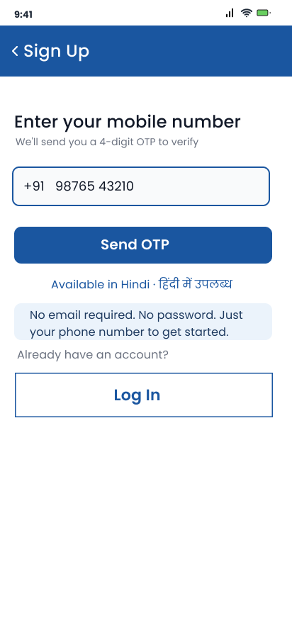
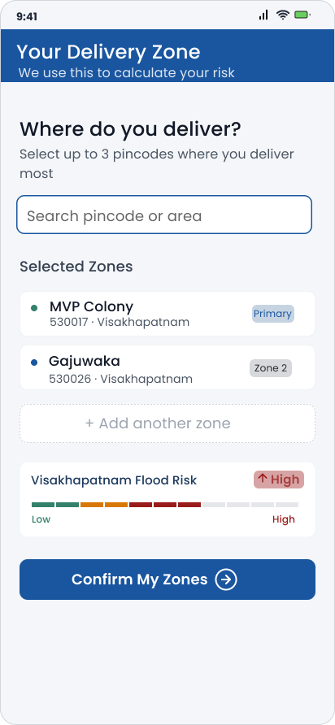

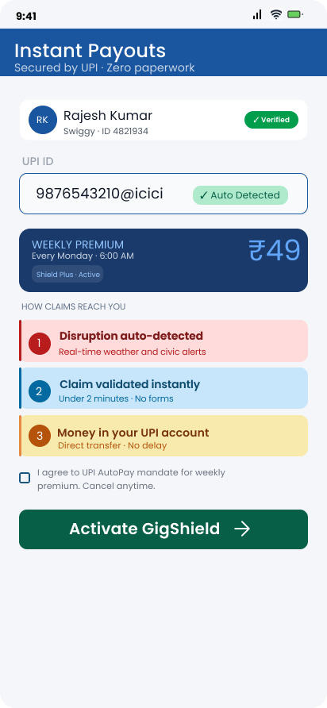

<br/>
<sub>Screen 01: Splash &nbsp;·&nbsp; Screen 02: OTP Entry &nbsp;·&nbsp; Screen 03: Zone Selection &nbsp;·&nbsp; Screen 04: Plan Selection &nbsp;·&nbsp; Screen 05: UPI Setup</sub>

</div>

---

<br/>

## PROTOTYPE SCREENS

<div align="center">

### Onboarding Flow


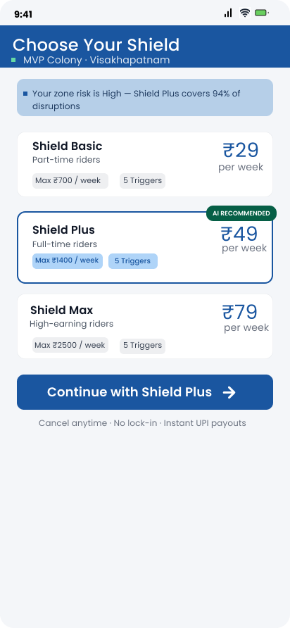


<br/>
<sub>Screen 01: Splash &nbsp;·&nbsp; Screen 02: OTP Entry &nbsp;·&nbsp; Screen 03: Zone Selection &nbsp;·&nbsp; Screen 04: Plan Selection &nbsp;·&nbsp; Screen 05: UPI Setup</sub>

<br/><br/>

### Forecast Shield & Trigger Flow

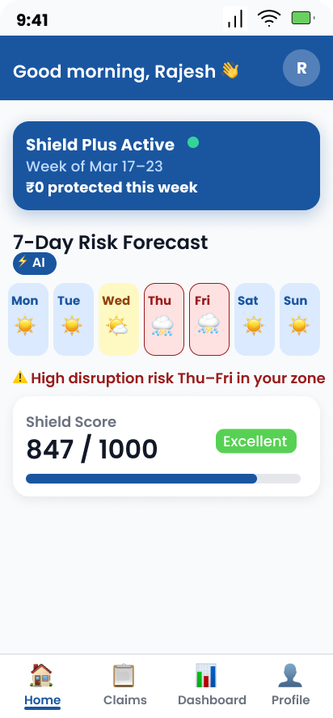
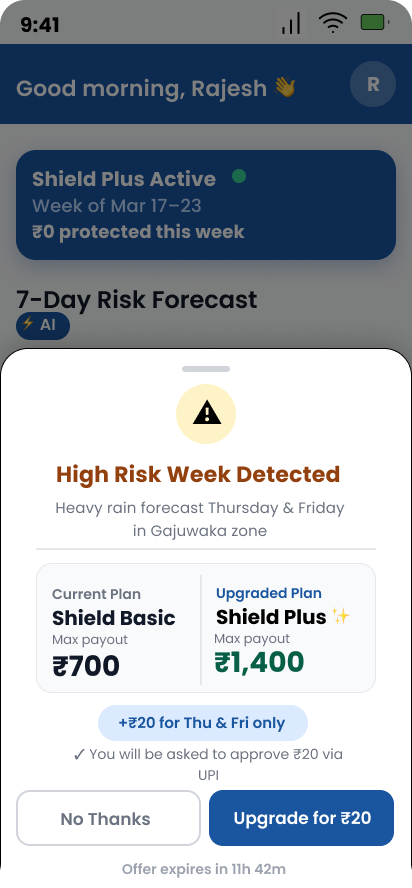
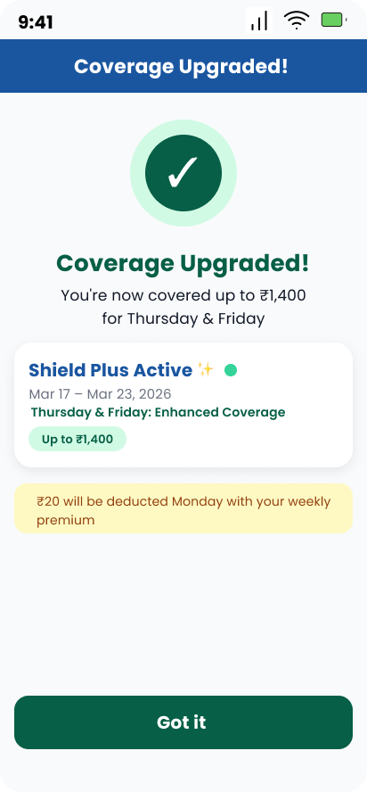
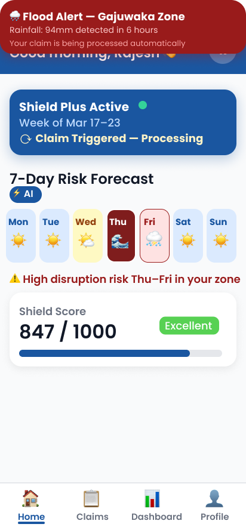

<br/>
<sub>Screen 06: Home &nbsp;·&nbsp; Screen 07: Forecast Alert &nbsp;·&nbsp; Screen 08: Upgrade Confirm &nbsp;·&nbsp; Screen 09: Disruption Alert</sub>

<br/><br/>

### Payout & Dashboard Flow

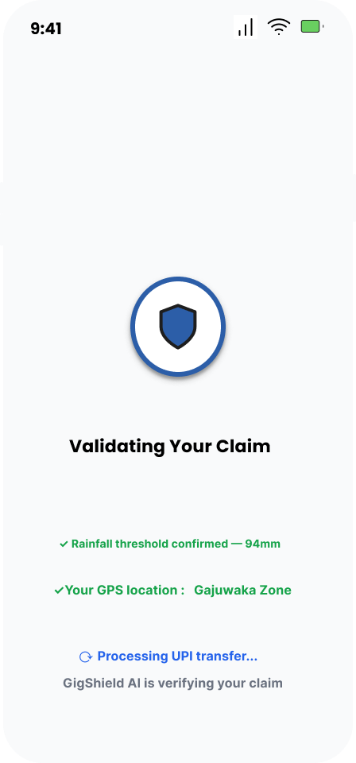
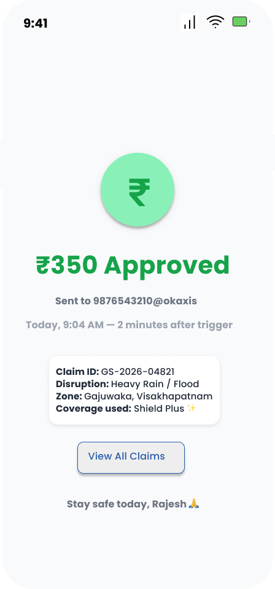
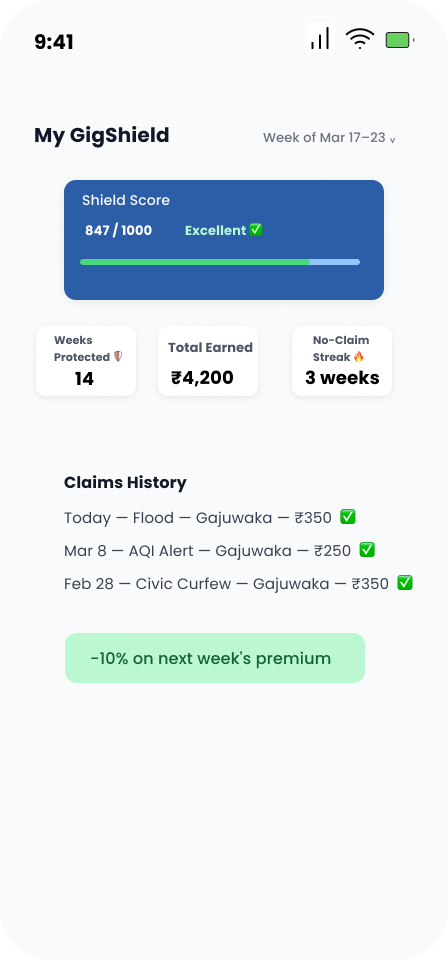
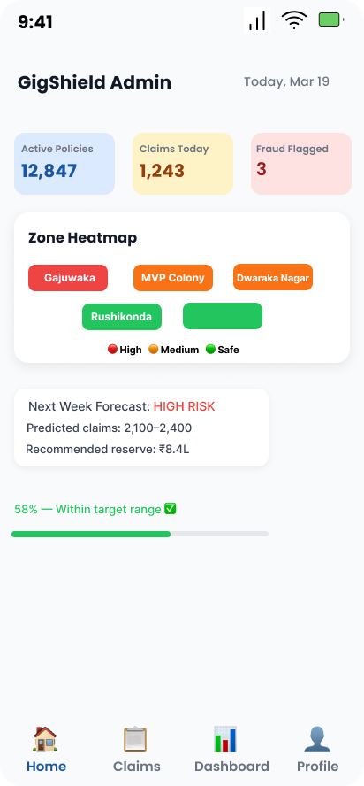

<br/>
<sub>Screen 10: Claim Processing &nbsp;·&nbsp; Screen 11: Payout Success &nbsp;·&nbsp; Screen 12: Worker Dashboard &nbsp;·&nbsp; Screen 13: Admin Dashboard</sub>

</div>


---

<br/>

## REPOSITORY STRUCTURE

```
GigShield/
│
├── README.md
├── .gitignore
├── LICENSE
│
└── docs/
    |
    │
    └── wireframes/
        ├── screen01_splash.png
        ├── screen02_otp_entry.png
        ├── screen03_zone_selection.png
        ├── screen04_plan_selection.png
        └── screen05_upi_setup.png
```

---

<div align="center">


</div>
